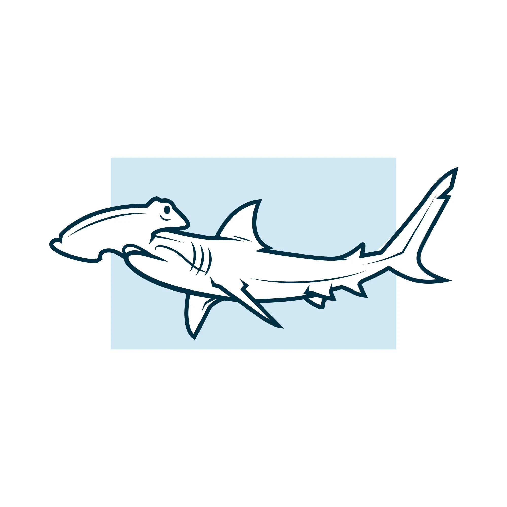

<h1 align="center">Hammerhead</h1>

<p align="center">
  
</p>

Hammerhead is a web-based desktop application that allows developers to interact with a large language model (LLM) through a chat interface.
It supports multiple languages and provides a user-friendly experience for querying and receiving responses from the LLM.

Good for testing and experimenting with LLMs, Hammerhead is designed to be extensible, allowing developers to add custom components and features.

## Get started

Install node modules and download the model files:

```bash
npm install
```

Start the project:

```bash
npm start
```

## RAG (Retrieval-Augmented Generation)

To enable RAG functionality, you need to set up a vector database and configure the application to use it. Follow these steps:

1. **Run the Chroma vector database**:
   - You can use the provided `npm run chroma` command to run the database locally.
   - Make sure you have Docker installed and running.

2. **Configure the ingestion of documents**:
   - Use the `npm run ingest` command to ingest documents into the vector database.
   - This command will read files from the `./data` directory and store them in the database.

The application will automatically connect to the Chroma vector database and use it for RAG functionality.