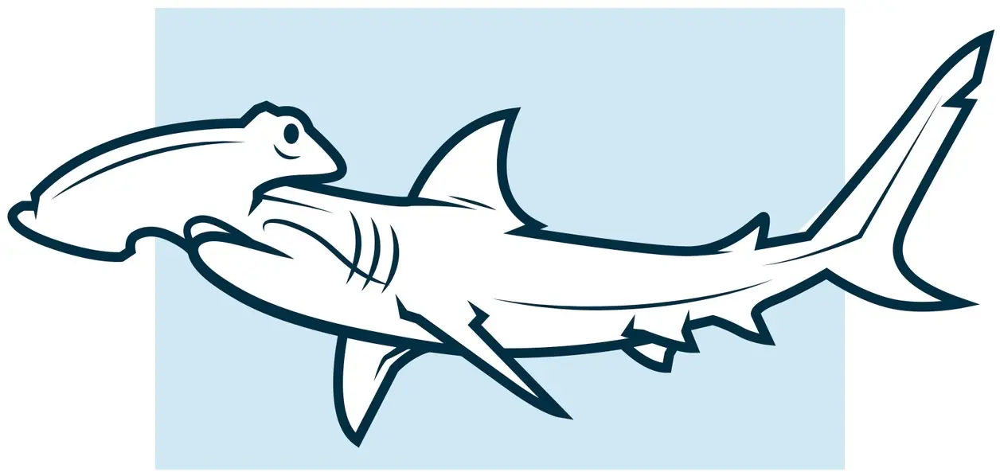
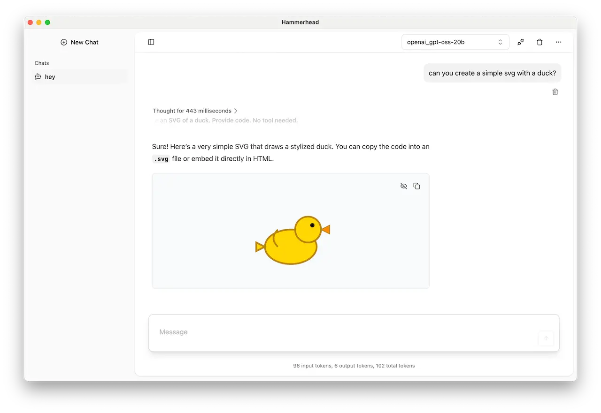
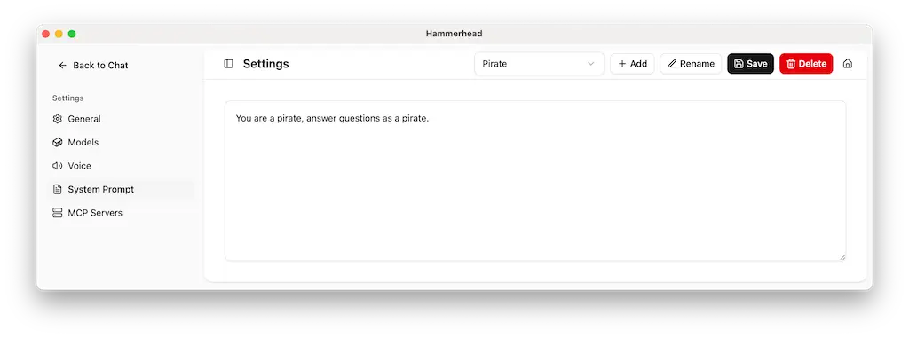
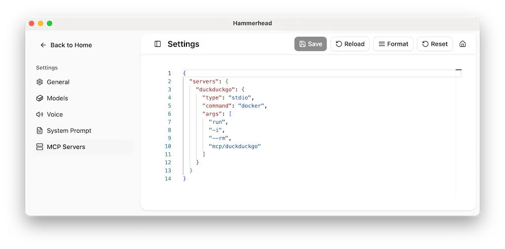

<h1 align="center">Hammerhead</h1>

<p align="center">
  
</p>

Hammerhead is a web-based desktop application that allows developers to interact with a large language model (LLM) through a chat interface.

It supports multiple languages and provides a user-friendly experience for querying and receiving responses from the LLM.

Good for testing and experimenting with LLMs, Hammerhead is designed to be extensible, allowing developers to add custom components and features.

> **⚠️ Development Status**: Hammerhead is in active development and features may break or change between releases.
> **🚀 Perfect Base for Custom Apps**: This project serves as an excellent foundation for building custom chat applications with LLMs.
> **🤝 Contributions Welcome**: We welcome contributions, bug reports, and feedback! Feel free to open issues or submit pull requests.

## Features

- 🤖 **Multi-LLM Support**: Chat with various large language models locally
- 🌐 **Multi-language Interface**: Support for multiple languages
- 🔌 **Extensible Architecture**: Easy to add custom components and features
- 📚 **RAG Integration**: Retrieval-Augmented Generation with vector database support
- 🔗 **MCP Protocol**: Model Context Protocol server integration
- 💬 **User-friendly Chat Interface**: Intuitive design for seamless interactions
- 🖥️ **Cross-platform Desktop App**: Built with Electron for Windows, macOS, and Linux

## Prerequisites

Before getting started, make sure you have:

- **Node.js** (v18 or higher)
- **npm** or **yarn**
- **Docker** (required for voice input)
- At least **8GB RAM** (recommended for running larger models)

## Get started

Install node modules and download the model files:

```bash
npm install
```

Start the project:

```bash
npm start
```



## Models

The application supports GGUF format models.

You can download models from Hugging Face or other sources. Hammerhead provides minimalistic model hub for easy access. Reach it via the `Models` menu or model selector.


## System Prompts

Hammerhead allows you to configure system prompts for different models. This can help tailor the behavior of the models to better suit your needs.

Access system prompts via the `Settings` menu. You can have multiple system prompts for different scenarios.



## MCP (Model Context Protocol)

Hammerhead can connect to MCP servers to run functions like text generation, summarization, and more.

You can configure MCP server settings in the application:

`Menu -> Settings -> MCP Servers`



Recommended servers:

- [DuckDuckGo](https://hub.docker.com/mcp/server/duckduckgo/overview)

## Development

### Building from Source

```bash
# Install dependencies
npm install

# Start development server
npm run dev

# Build for production
npm run build
```

### Project Structure

- `electron/` - Electron main process and related services
- `src/` - React frontend application
- `models/` - LLM model files (GGUF format)
- `data/` - Document storage for RAG functionality

### Contributing

1. Fork the repository
2. Create a feature branch (`git checkout -b feature/amazing-feature`)
3. Commit your changes (`git commit -m 'Add amazing feature'`)
4. Push to the branch (`git push origin feature/amazing-feature`)
5. Run tests (`npm test`)
6. Run linting (`npm run lint`)
7. Open a Pull Request

## License

This project is licensed under the Apache 2.0 License - see the [LICENSE](LICENSE) file for details.

## Support

If you encounter any issues or have questions, please:

- Open an issue on GitHub
- Check the [documentation](./docs/) for detailed guides
- Join our community discussions
